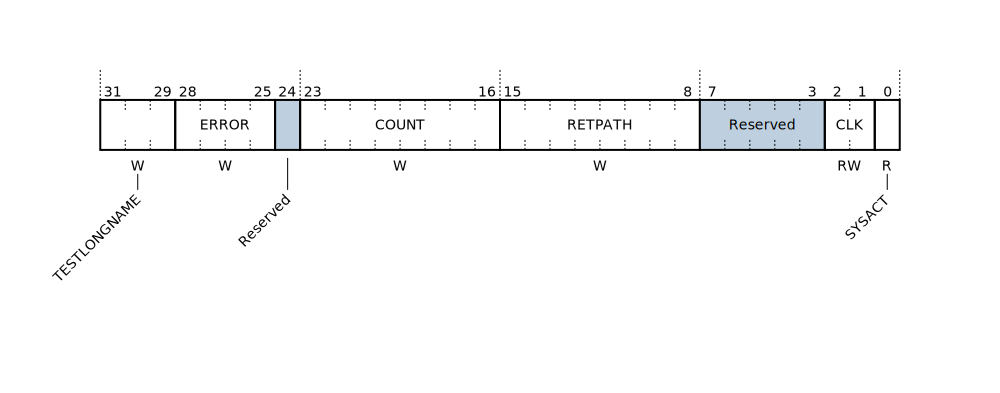

# bfield-js
A Bitfield Generator tool.

# Sample Website
A sample website provides the tooling for the library and can be found at: https://kenkaijie.github.io/bfield-js/example-index.html

# How to Use
The function takes in 2 parameters and their configurations. The bitfield parameter defines the field. The current version does not support undefined fields (currently you can skip a string field by setting it to an empty string). potential future support for default values is possible.

## Bitfield Declaration Schema

| Attribute Name | Type | Description |
| :------------ |:-------------| ----- |
| name | string | The name of this field, if the name exceeds the graphic length of the field, it will be placed below the field (see example). |
| bitStart | number | The starting bit, note that this is 0-indexed. |
| bitEnd | number | The end bit, should be greater than or equal to the start bit. Also 0-indexed. |
| access | string | The access of this field, this is placed directly below the field graphic. Tyical values are R (Read), W (Write) or RW (Read and Write). |
| shaded | bool | Set true to shade the bitfield graphic |

## Options Schema

| Option Name | Type | Description | Default |
| :--- | :--- | ---- | ----|
| majorTick | number | Used to set the period of the major tick marker (in bits). | 8 |
| showBitTick | bool | Set to true to show the individual bit ticks. | true |
| msbRight | bool | Set true to have the MSB (most significant bit) displayed on the right most bit. | false |
| showAccess | bool | Set true to show the access attribute. | true |
| bitWidth | number | Width of each bit rectangle in the bit field graphic. | 25 |
| bitHeight | number | Height of each bit rectangle in the bit field graphic. | 50 |


## Example Bitfield and Bitfield Options
Below shows an example of a bit field. This is the same parameter as the sample website and will yield the same results.

```javascript
    var bitfields = [
        {bitStart:0, bitEnd:0, access:"R", name:"SYSACT", shaded: false},
        {bitStart:1, bitEnd:2, access:"RW", name:"CLK", shaded: false},
        {bitStart:3, bitEnd:7, access:"", name:"Reserved", shaded: true},
        {bitStart:8, bitEnd:15, access:"W", name:"RETPATH", shaded: false},
        {bitStart:16, bitEnd:23, access:"W", name:"COUNT", shaded: false},
        {bitStart:24, bitEnd:24, access:"", name:"Reserved", shaded: true},
        {bitStart:25, bitEnd:28, access:"W", name:"ERROR", shaded: false},
        {bitStart:29, bitEnd:31, access:"W", name:"TESTLONGNAME", shaded: false},
    ];
    var bitfieldOptions = {
        majorTick:8,
        showBitTick: true,
        msbRight: false,
        showAccess: true,
        bitWidth : 25,
        bitHeight : 50,
    };
```

